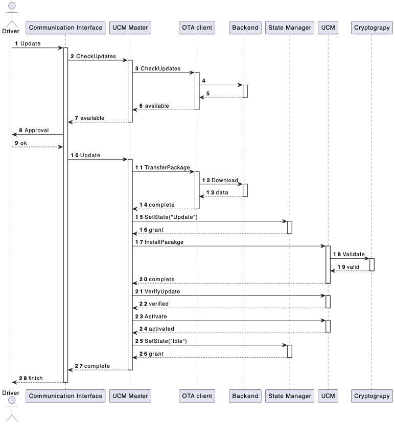

# О проекте

Упрощенная частичная реализация требований [AUTOASR Specification of Update and Configuration Management](https://www.autosar.org/fileadmin/standards/R21-11/AP/AUTOSAR_SWS_UpdateAndConfigurationManagement.pdf)[1] на базе [KasperskyOS CE](https://os.kaspersky.ru/development/)[2] для демонстрации киберимунного подхода в разработке.

# Описание компонентов системы

Согласно спецификации[[1]](#links) функциональный кластер (подсистема) `Update and Configuration Management` содержит следующие компоненты:
- `OTA Client` проверяет наличие установочных пакетов на `Backend` и скачивает их по запросу `UCM MAster`
- `UCM Master` отвечает за оркестрацию процесса установки
- `UCM` отвечает за проверку, установку и активацию пакета

К задачам подсистемы относятся установка, обновление и удаление программного обеспечения на платформе безопасным и надежным способом. В рамках данного примера рассмотрим лишь сценарий установки/обновления, исключив и удаление.

# Взаимодействие с другими подсистемами

В процессе своей работы подсистмма `Update and Configuration Management` взаимодействует со смежными подсистемами:

- `Vehicle State Manager` сообщает текущее состояние транспортного средства
- `Vehicle Communication Interface` отвечает за взаимодействие с водителем
- `Cryptography` - набор криптографических алгоритмов

Через `OTA Client` она также взаимодействует с внешней подсистемой `Backend`, хранящей пакеты для установки.

# Допущения и ограничения

Демонстрационный пример не призван в точности реализовать спецификации `AUTOSAR`, поэтому набор компонентов и их функционал намеренно ограничен и изменен с целью упрощения.

# Базовый сценарий

- Водитель (или сервисный инженер) с помощью консоли управления иницирует проверку обновлений. 
- Консоль управления переадресует запрос в `UCM master`.
- `UCM master` с помощью `OTA Client` получает информацию о наличии обновлений на `Backend`.
- Консоль запрашивает подтверждение у водителя на скачивание и установку обновлений
- `UCM Master` проверяет, что транспортное средство находится в допустимом для начала обновления состоянии и переводит его в режим обновления
- `UCM Master` инициирует скачивание обновлений
- `UCM Master` передает команду в `UCM` на установку пакета
- `UCM` проверяет подпись пакета в модуле `Crypto`
- После успешной проверки происходит установка пакета
- После установки пакета происходит его проверка и активация
- По завершении активации транспортное средство переводится в дежурный режим и сообщается водителю об окончании установки обновлений.

# Цели безопасности

В рамках демонстрационного примера определим следующие цели безопасности:
1. `ЦБ-1` Обеспечить установку только аутентичных пакетов
1. `ЦБ-2` Установка пакетов возможна только при нахождении транспортного средства в безопасном (дежурном) режиме

# Предположения безопасности

- `ПБ-1` Злоумышленник не имеет криптографических ключей подписи пакетов

# Диаграмма состояний

При обновлении транспортное средство должно находиться в безопасном состоянии (`ЦБ-2`). Определим диаграмму состояний и переходов следующим образом:

Установка и обновление модулей возможно только в состоянии `Update`.

# Негативные сценарии

Рассмотрим негативные сценарции, в рамках которых злоумышленник может получить контроль над одной или несколькими подсистемами и попытаться нарушить задеклариорлванные ранее цели безопасности.

## НС-1

Установка произвольного пакета в произвольный момент времени при компрометации `UCM`. Нарушение `ЦБ-1` и `ЦБ-2`.

В случае компрометации модуля `UCM` злоумышленнику становится доступна установка произвольного пакета, без проверки его аутентичности в модуле `Crypto`, тем самым появляется возможность нарушения `ЦБ-1`. Контроль над модулем `UCM` также позволяет злоумышленнику выполнить установку пакета в произвольный момент времени, нарушив `ЦБ-2`.

## НС-2

Установка в произвольный момент времени при компрометации `State Manager`. Нарушение `ЦБ-2`.

Компрометация модуля `State Manager` позволяет злоумышленнику подменить ответ и разрешить установку, например, во время движения транспортного средства, тем самым, нарушив `ЦБ-2`. 

## НС-3

Комомпрометациия модуля `OTA Client` может привести к тому, что обновления не будут установлены либо будет израсходован сетвой трафик при скачивании скомпрометированного пакета обновления. Но компрометация одного этого модуля не приводит к нарушению завявленных целей безопасности: подмена пакета будет выявлена на этапе провекри его криптографиеской подписи (с учетом `ПБ-1`).

## НС-4

При компрометации модуля `UCM Master` становится доступна установка модуля в произвольный момент времени, нарушая `ЦБ-2`. 
Сценарий аналогичен `НС-2`.
Негативные последствия, не приводящие к нарушению целей безопасности аналогичны `НС-3`.

## НС-5

Компрометация модуля `Communication Interface` не нарушает целей безопасности, но может привести к следюущим негативным последствиям:
- Отсутствие установки обновлений (при игнорировании ответа `UCM Master` о наличии обновлений)
- * При наличии в системе возможности удаления пакетов злоумышленнику может быть доступен этот функционал. Будем считать, что в нашей системе этот функционал не реализован. При наличии соответствующих требований необходимо будет адаптировать механизмы защиты.

## НС-6

При рассмотрении `НС-3` и `НС-4` атака стала невозможной из-за ее выявления на этапе проверки подписи.
Однако, при одновременной компрометации `OTA Client` (либо `UCM Master`) и `Crypto` становится доступна установка произвольного пакета. Такая атака приводит к нарушению `ЦБ-1`.

## НС-7

При компрометации модуля `Crypto` возможен отказ в установке легитимных пакетов, что не нарушает целей безопасности.

# Политика архитектуры

Проведя анализ целей безопасности, предположений безопасности и описанных негативных сценариев определим уровень доверия к каждому компоненту:

| Наименование | Уровень доверия | Обоснование | 
| --- |  --- |  --- | 
| `UCM` | доверенный | `НС-1` |
| `State Manager` | доверенный | `НС-2` |
| `Cryptography` | доверенный | `НС-3`, `НС-6` |
| `UCM Master` | доверенный | `НС-4` |
| `OTA Client` | недоверенный | Компрометация не нарушает ЦБ при доверенном компоненте `Cryptography` |
| `Communication interface` | недоверенный | Компрометация не нарушает ЦБ | 
Табл. 1

# Переработанная политика архитектуры

Полученное на предыдущем шаге решение содержит большое количество доверенного кода.
Компонент `UCM Master` вынужденно добавлен в список доверенных компонентов, т.к. его компрометация нарушает `ЦБ-2`. К тому же этот компонент является самым большим в системе. 

В целях минимизации доверенной кодовой базы, переработав базовый сценарий, этот компонент можно вывести из списка доверенных. Для этого достаточно вынести из него функциональность по взаимодействию со `State Manager`. `UCM` подходящий компонент, который мог бы взять на себя эту работу вместо `UCM Master`.

Доработаный базовый сценарий теперь выглядит следующим образом:

| Наименование | Уровень доверия | Обоснование | 
| --- |  --- |  --- | 
| `UCM` | доверенный | `НС-1` |
| `State Manager` | доверенный | `НС-2` |
| `Cryptography` | доверенный | `НС-3`, `НС-6` |
| `UCM Master` | недоверенный | Компрометация не нарушает ЦБ при доверенном компоненте `Cryptography`  |
| `OTA Client` | недоверенный | Компрометация не нарушает ЦБ при доверенном компоненте `Cryptography` |
| `Communication interface` | недоверенный | Компрометация не нарушает ЦБ | 
Табл. 2

Данное решение удовлетворяет завяленным целям безопасности.
Предложенная оптимизация позволила значительно сократить размер доверенной кодовой базы и уменьшить, связанный с этим объем работ.

# Ссылки

- [1] [Specification of Update and Configuration Management](https://www.autosar.org/fileadmin/standards/R21-11/AP/AUTOSAR_SWS_UpdateAndConfigurationManagement.pdf) (Release `R21-11`, Date `2021-11-25`)
- [2] [KasperskyOS CE](https://os.kaspersky.ru/development/)
- [3] [Requirements on Update and
Configuration Management](https://www.autosar.org/fileadmin/standards/R21-11/AP/AUTOSAR_RS_UpdateAndConfigurationManagement.pdf) (Release `R21-11`, Date `2021-11-25`)
